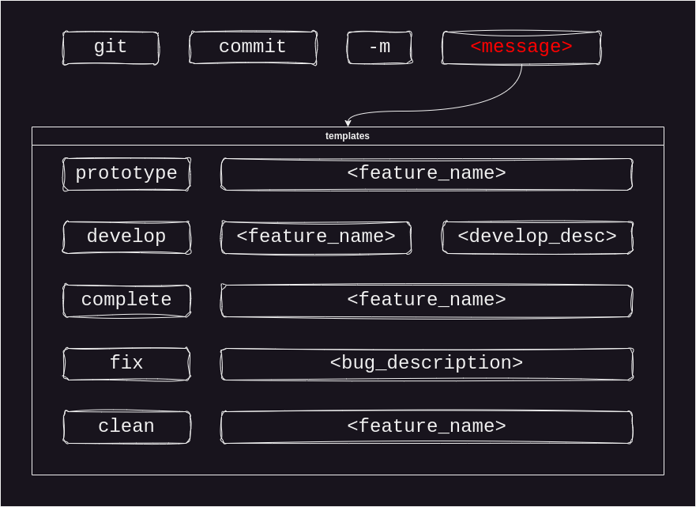

# My Git & Remotes Conventions

- bolds means criticals
- brackes means optionals
- italic means new's

# Git

## Commmit

## README

`README.md` items:
- **Name**
  - **important notes and links**
    - **link to docs and references**
  - table of contents
- **Purpose**
  - **main idea and end user target**
  - **main views screenshots**
  - project lifetime
- **Dependencies**
  - os
  - **major languages and frameworks versions and details**
  - **packages versions and details**
  - [tool softwares]
- **Usage and Run Protocols and Notes**
- [Tests and Results]
- [Contribution Conventions]
- Contacts
- [Thanks]
